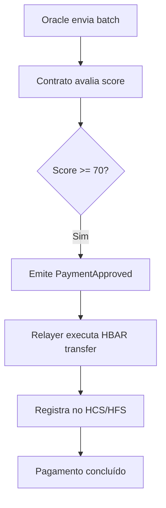

# W.A.T.A. Chain - Implementação Final

## ✅ **Contrato Único Implementado**

### 🔧 **PESContract.sol - Versão Unificada**

**Mantém todas as funcionalidades V2:**
- ✅ `createAgreement()` - Criação de acordos (funciona como antes)
- ✅ `submitValidatedBatch()` - Submissão de batches pelo oráculo
- ✅ `getAgreement()` - Consulta de acordos (compatibilidade V2)
- ✅ `requestPayment()` - Solicitação de pagamentos
- ✅ `recordAudit()` - Registro de auditoria
- ✅ Eventos V2: `AgreementCreated`, `PaymentApproved`, `ValidatedBatchSubmitted`

**Adiciona funcionalidades V3:**
- ✅ `createAgreementWithInvestor()` - Criação com investidor
- ✅ `investInAgreement()` - Investimentos em HBAR
- ✅ `executePayment()` - Execução de pagamentos com HCS/HFS
- ✅ `changeGovernanceMode()` - Mudança de modo de governança
- ✅ `recordAuditV3()` - Auditoria com HCS/HFS
- ✅ `getAgreementV3()` - Consulta completa V3
- ✅ `getPaymentRecord()` - Consulta de registros de pagamento
- ✅ Eventos V3: `AgreementCreatedV3`, `InvestmentReceived`, `PaymentApprovedV3`, `PaymentExecuted`

### 🏗️ **Estrutura Expandida**

```solidity
struct Agreement {
    bytes32 agreementHash;
    address producer;
    address investor;        // NOVO: investidor
    uint256 baseValue;
    uint256 hectares;
    bool isActive;
    uint256 createdAt;
    uint256 lastScore;
    bytes32 lastAuditHash;
    uint256 lastUpdateTimestamp;
    GovernanceMode governanceMode;  // NOVO: modo de governança
    uint256 totalInvested;         // NOVO: total investido
    uint256 totalPaid;             // NOVO: total pago
}

enum GovernanceMode {
    AUTO,           // Automático (hackathon)
    HYBRID_SIMPLE,  // Aprovação financeira
    HYBRID_FULL     // Aprovação técnica + financeira
}
```

### 🔄 **Relayer Unificado**

**Mantém lógica V2:**
- ✅ Processamento de pagamentos existente
- ✅ Event listeners para `PaymentApproved`
- ✅ Compatibilidade com contratos V2

**Adiciona funcionalidades V3:**
- ✅ HCS/HFS integration
- ✅ Transferências HBAR automáticas
- ✅ Auditoria robusta
- ✅ Flag `USE_V3_FEATURES` para controle

### 🚀 **Fluxo de Pagamento Unificado**



### ⚙️ **Configuração**

```env
# Feature Flags
USE_V3_FEATURES=true

# Contract Configuration
CONTRACT_ADDRESS=0x...

# HCS Configuration
HCS_TOPIC_ID=0.0.123456

# Governance Configuration
FINANCIAL_MANAGER_ADDRESS=0.0.123456
TECHNICAL_MANAGER_ADDRESS=0.0.123456
```

### 🎯 **Benefícios da Implementação**

#### **Compatibilidade Total**
- ✅ **Lógica V2 preservada** - Todas as funções antigas funcionam
- ✅ **Eventos duplos** - Emite V2 e V3 para compatibilidade
- ✅ **Transição suave** - V3 features opcionais

#### **Funcionalidades V3**
- ✅ **Auditoria robusta** - HCS para imutabilidade + HFS para relatórios
- ✅ **Pagamentos automáticos** - HBAR transfers quando score ≥ 70%
- ✅ **Sistema de investimentos** - Investidores podem aportar HBAR
- ✅ **Governança escalável** - AUTO (hackathon) + HYBRID (futuro)

#### **Frontend Organizado**
- ✅ **Componentes reutilizáveis** - StatCard, ScoreBadge, LoadingSpinner
- ✅ **Utilitários separados** - formatters, colors, constants
- ✅ **Sistema de autenticação** - AuthContext, LoginModal, UserMenu
- ✅ **Conexão de carteira** - WalletContext, WalletConnectButton
- ✅ **Dashboards específicos** - ProducerDashboard, InvestorDashboard

### 🚀 **Próximos Passos**

1. **Deploy do contrato único** - `PESContract.sol` com V2 + V3
2. **Configurar HCS/HFS** - Topic ID e file storage
3. **Testar fluxo completo** - Oracle → Contrato → Relayer → HBAR
4. **Integrar carteiras reais** - HashPack, Blade Wallet
5. **Ativar V3 features** - `USE_V3_FEATURES=true`

### ⚠️ **Notas Importantes**

- **Uma versão apenas** - Contrato único deployado
- **Lógica preservada** - Todas as funcionalidades V2 continuam funcionando
- **Eventos unificados** - Apenas `PaymentApproved` (não `PaymentPending`)
- **Transição suave** - V3 features podem ser ativadas gradualmente

A implementação está **pronta para deploy** e mantém 100% de compatibilidade com o sistema existente! 🎯
